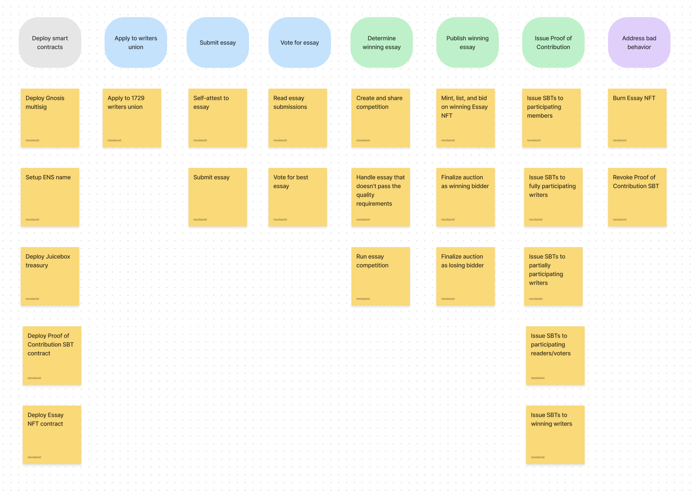

# 1729w

[1729 Writers](https://paper.li/1729writers) is an experiment in coordinating independent writing with decentralized funding, focused on truth, health, wealth, and other ideas related to Balaji Srinivasan’s new book [The Network State](https://thenetworkstate.com).

## General Info

_more info to come_

### Who

### Why

### What

#### Draft Workflow

## Behind-the-scenes

### How it works

### How to contribute

Ensure you complete **all the steps** before submitting a pull request:

- [✔️] Run `forge snapshot` (writes a snapshot of each test's gas usage)
- [✔️] Run `forge fmt` (enforces code style formatting rules)
- [✔️] Run `forge test` (runs the unit test suite via foundry)
- [✔️] Run `cargo test` (runs the behavior test suite via cucumber-rs + ethers-rs)

## Acknowledgements

xyz
